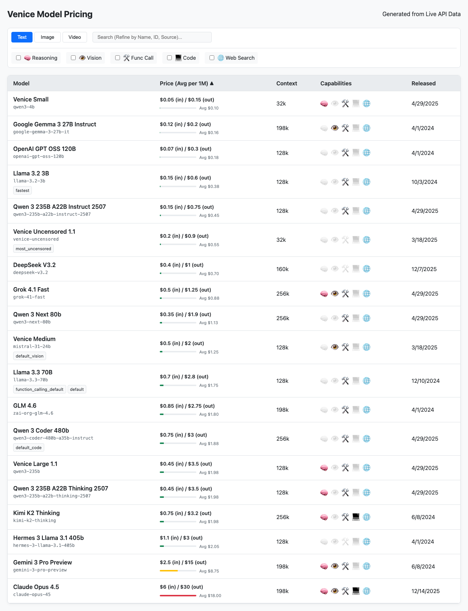

# Venice Pricing & Model List

[](https://keikeikeikeikeikeikeikei.github.io/venice-model-dashboard/)

This project fetches model data from the Venice.ai API and generates interactive HTML tables for comparing pricing, capabilities, and constraints of Text, Image, and Video models.



## Usage

### 1. Update Data & Generate Lists
Run the automation script to fetch the latest data and rebuild the HTML files:

```bash
./scripts/update_all.sh
```

### 2. View Results
Open `docs/index.html` in your web browser to navigate the generated lists:
- **Text Models**: Pricing, context window, capabilities (Reasoning, Code, etc.)
- **Image Models**: Generation costs, upscale pricing, constraints.
- **Video Models**: **Real-time pricing** (automatically fetched), resolution, duration, and audio support.
- **Dashboard**: Unified view with relative price comparison and interactive filters.

## Project Structure

```
├── update.sh           # Main automation script
├── data/               # Consolidated JSON data
├── docs/               # Generated Dashboard (index.html)
├── scripts/
│   ├── fetch.py        # Data fetcher
│   ├── build.py        # Dashboard builder
│   ├── templates/      # Jinja2 templates
│   └── dev/            # Development tools
└── requirements.txt    # Python dependencies
```

## Features

- **Automated Data Fetching**: Pulls latest model information from Venice.ai API
- **Dynamic Video Pricing**: Automatically queries the Video Quote API for real-time pricing
- **Interactive Tables**: Sort and filter models by various criteria
- **Unified Codebase**: DRY principle with Jinja2 templates eliminating code duplication
- **Responsive Design**: Works on desktop and mobile devices
- **Modular Architecture**: Clean separation of concerns for easy maintenance

## Requirements

Install dependencies:

```bash
uv pip install -r requirements.txt
```

Or manually:
- Python 3.7+
- `jinja2` - Template engine for HTML generation
- `requests` - For API calls
- `playwright` (optional) - For development/debugging

